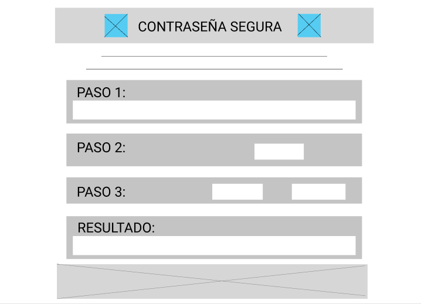

# TÍTULO: CONTRASEÑA SEGURA (Cifrado César)

##  RESUMEN:
* "CONTRASEÑA SEGURA" es un programa web que gracias a la implementación de un logaritmo permite a los usuarios CIFRAR y/o DESCIFRAR un mensaje siendo aquél mismo quien decida el número de deplazamiento de posiciones que desee ejecutar.

### IMAGEN FINAL DEL PROYECTO:

* 

#### INVESTIGACIÓN UX:
  1. USUARIOS Y OBJETIVOS CON RELACIÓN AL PRODUCTO
    * Tras identificar que la mayoría de personas de diversos rangos de edad, clase social, géneros y ubicación geográfica tienen una angustia que a veces puede ser interpretado como miedo a que un ajeno descubra las contraseñas de sus aplicaciones y verse expuesto ante el qué dirán, "CONTRASEÑA SEGURA" está dirigida al público general que esté interesado en obtener una contraseña más aleatoria y dificil de descubrir, para así sentirse seguros de que nadie podrá ingresar a sus diversas cuentas de aplicaciones. 
  2. ¿CÓMO "CONTRASEÑA SEGURA" SOLUCIONA LOS PROBLEMAS/NECESIDADES DE DICHOS USUARIOS?
    * "CONTRASEÑA SEGURA " facilita a los usuarios a obtener una contraseña más difíciles de hackear sin la necesidad de recordar un texto complicado para memorizar. Y también, gracias a la variedad de número de desplazamiento que tiene, puede con una sola palabra clave para ellos, usar diferentes offset's y obtener contraseñas seguras para cada aplicación que deseen.
  3. FOTO PRIMER PROTOTIPO PAPEL 
    
  4. Me recomendaron que la palabra 'INGRESE TEXTO A CODIFICAR AQUÍ' estaba un poco mal entendido, porque ese texto da a entender que solo se puede ingresar texto más no que puede mostrar el resultado. Por ello, decidí cambiarlo por 'Cifra aquí'. Sin embargo, mi prototipo no era comprendido por diferentes usuarios, era necesario explicarles qué función tenía cuadro o botón y se complicaban. Tras las recomendaciones recogidas consulté la posibilidad de que solo exita un cuadro en donde ingresen el texto que deseen, un offset y dos botones que digan cuál es la función que quieren realizar. Además, decidí agregar al diseño la secuencia de lo que realiza este producto paso a paso, hasta llegar al resultado final.
  5. SEGUNDO PROTOTIPO
    

------------------------------------------------------*-*-----------------------------------------------------------------
## 3. Objetivos de aprendizaje

En este proyecto aprenderás a construir una aplicación web (_WebApp_) que
interactuará con el usuario final a través del navegador utilizando HTML, CSS y
JavaScript como herramientas.

Reflexiona y luego marca los objetivos que has llegado a **entender** y
**aplicar** en tu proyecto.

### UX

* [x] [Diseñar la aplicación pensando y entendiendo al usuario](https://lms.laboratoria.la/cohorts/lim-2020-01-bc-core-lim012/courses/intro-ux/01-el-proceso-de-diseno/00-el-proceso-de-diseno)
* [x] [Crear prototipos para obtener feedback e iterar](https://lms.laboratoria.la/cohorts/lim-2020-01-bc-core-lim012/courses/product-design/00-sketching/00-sketching)
* [ ] [Aplicar los principios de diseño visual](https://lms.laboratoria.la/cohorts/lim-2020-01-bc-core-lim012/courses/product-design/01-visual-design/01-visual-design-basics)

### HTML y CSS

* [ ] [Uso correcto de HTML semántico](https://developer.mozilla.org/en-US/docs/Glossary/Semantics#Semantics_in_HTML)
* [ ] [Uso de selectores de CSS](https://developer.mozilla.org/es/docs/Web/CSS/Selectores_CSS)
* [x] [Construir tu aplicación respetando el diseño realizado](https://lms.laboratoria.la/cohorts/lim-2020-01-bc-core-lim012/courses/css/01-css/02-boxmodel-and-display) (maquetación).

### DOM

* [x] [Uso de selectores de nodos del DOM](https://lms.laboratoria.la/cohorts/lim-2020-01-bc-core-lim012/courses/browser/02-dom/03-1-dom-methods-selection)
* [ ] [Manejo de eventos del DOM](https://lms.laboratoria.la/cohorts/lim-2020-01-bc-core-lim012/courses/browser/02-dom/04-events)
* [ ] [Manipulación dinámica del DOM](https://developer.mozilla.org/es/docs/Referencia_DOM_de_Gecko/Introducci%C3%B3n)

### Javascript

* [x] [Manipulación de strings](https://lms.laboratoria.la/cohorts/lim-2020-01-bc-core-lim012/courses/javascript/06-strings/01-strings)
* [ ] [Uso de condicionales](https://lms.laboratoria.la/cohorts/lim-2020-01-bc-core-lim012/courses/javascript/02-flow-control/01-conditionals-and-loops)
* [x] [Uso de bucles](https://lms.laboratoria.la/cohorts/lim-2020-01-bc-core-lim012/courses/javascript/02-flow-control/02-loops)
* [ ] [Uso de funciones](https://lms.laboratoria.la/cohorts/lim-2019-09-bc-core-lim011/courses/javascript/02-flow-control/03-functions)
* [x] [Datos atómicos y estructurados](https://www.todojs.com/tipos-datos-javascript-es6/)
* [ ] Utilizar ES Modules (`import` | `export`).

### Testing

* [] [Testeo de tus funciones](https://jestjs.io/docs/es-ES/getting-started)

### Git y GitHub

* [x] [Comandos de git](https://lms.laboratoria.la/cohorts/lim-2019-09-bc-core-lim011/courses/scm/01-git/04-commands)
  (`add` | `commit` | `pull` | `status` | `push`).
* [x] [Manejo de repositorios de GitHub](https://lms.laboratoria.la/cohorts/lim-2019-09-bc-core-lim011/courses/scm/02-github/01-github)  (`clone` | `fork` | `gh-pages`).

### Buenas prácticas de desarrollo

* [ ] Organizar y dividir el código en módulos (Modularización).
* [ ] Uso de identificadores descriptivos (Nomenclatura | Semántica).
* [ ] Uso de linter para seguir buenas prácticas (ESLINT).

